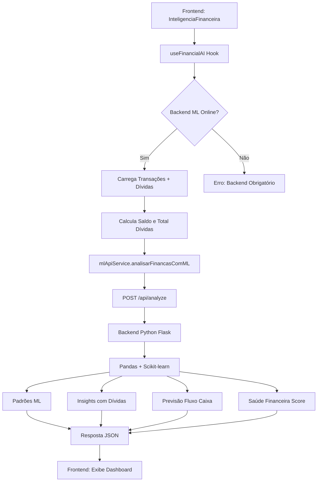

# Atualização: Backend ML Obrigatório - Análise Apenas Caixa e Dívidas

## 📋 Resumo das Mudanças

Sistema de Inteligência Financeira agora é **100% backend ML**, analisando **apenas transações de caixa** (entradas/saídas) e **dívidas**.

---

## 🎯 O Que Foi Alterado

### 1. **Frontend - useFinancialAI.ts**
✅ **Removido:**
- Função `analisarComJavaScript` (400+ linhas deletadas)
- Fallback JavaScript quando backend offline
- Query de `categorias_de_gasto`
- Query de `despesas_de_obra` (gastos de obras)
- Verificação `isDevelopment`

✅ **Adicionado:**
- Query de `dividas` (dívidas ativas: status != 'quitado')
- Cálculo de `totalDividas` (soma de `valorRestante`)
- Erro obrigatório se backend ML offline
- Passagem de `saldoAtual`, `totalDividas`, `dividasData` para API

### 2. **Frontend - mlApiService.ts**
✅ **Atualizado:**
- Assinatura: `analisarFinancasComML(transacoes, gastos_obras=[], saldoAtual?, totalDividas?, dividas?)`
- Request body inclui: `saldo_atual`, `total_dividas`, `dividas`
- `gastos_obras` sempre enviado como array vazio `[]`

### 3. **Backend - app.py**
✅ **Refatorado Completamente:**

#### `prepare_dataframe(transacoes, dividas=None)`
- **Antes:** Recebia `transacoes` e `gastos_obras`
- **Agora:** Recebe `transacoes` e `dividas`
- Cria `df_dividas` com campos: valor, valorRestante, vencimento, status

#### `analyze_patterns_ml(df_trans)`
- **Antes:** `(df_trans, df_gastos)` - combinava ambos
- **Agora:** `(df_trans)` - apenas transações de caixa
- Analisa APENAS `tipo == 'saida'` do caixa
- Sem combinação de dados de obras

#### `generate_insights_ml(df_trans, padroes, saldo_atual, total_dividas, df_dividas)`
- **Antes:** Analisava obras e transações
- **Agora:** Insights focados em:
  - Anomalias em saídas de caixa
  - Saldo em caixa (crítico < R$ 1000, saudável > R$ 10000)
  - Dívidas vencidas (status == 'vencida')
  - Ratio dívidas/saldo (alerta se > 200%)
  - Taxa de economia (entradas vs saídas)
  - Padrões sazonais em saídas

#### `calculate_financial_health_ml(df_trans, padroes, saldo_atual, total_dividas)`
- **Score Base:** 50 pontos
- **Fator 1:** Liquidez (+25 pts)
- **Fator 2:** Saldo em caixa (+15 pts se > R$ 5000, -20 pts se negativo)
- **Fator 3:** Penalidade por dívidas (-30 pts se ratio > 5x saldo)
- **Fator 4:** Consistência nas saídas (+10 pts baixo desvio)
- **Fator 5:** Tendências positivas (+10 pts)

#### `analyze_behavior(df_trans)`
- **Antes:** `(df_trans, df_gastos)` - combinava dados
- **Agora:** `(df_trans)` - apenas caixa
- Analisa apenas saídas do caixa

#### `@app.route('/api/analyze')`
- **Request Body:**
  ```json
  {
    "transacoes": [...],
    "dividas": [...],
    "saldo_atual": 5000.00,
    "total_dividas": 2000.00
  }
  ```
- **Recomendações focadas em:**
  - Dívidas críticas (se > 2x saldo)
  - Saúde financeira baixa
  - Quitação antecipada se saldo saudável

---

## 🔍 Dados Analisados

### ✅ **O Que É Analisado:**
1. **Transações de Caixa:**
   - Entradas: receitas, recebimentos
   - Saídas: despesas, pagamentos
   - Categorias: apenas das transações de caixa

2. **Dívidas:**
   - Valor total restante
   - Status (ativa, vencida, quitada)
   - Datas de vencimento

3. **Saldo em Caixa:**
   - Calculado: soma(entradas) - soma(saídas)

### ❌ **O Que NÃO É Analisado:**
- ~~Gastos de obras (`despesas_de_obra`)~~
- ~~Categorias de gasto genéricas (`categorias_de_gasto`)~~
- ~~Dados de funcionários~~
- ~~Materiais de construção~~

---

## 🚀 Fluxo de Análise



---

## 📊 Insights Gerados

### 1. **Anomalias em Saídas**
- Detecta transações com Z-score > 2
- Alerta para gastos muito acima da média

### 2. **Análise de Saldo**
- Saldo < R$ 1000: **Crítico** 🚨
- Saldo > R$ 10000: **Saudável** 💰

### 3. **Dívidas Vencidas**
- Lista quantidade e valor total
- Priorização de pagamentos

### 4. **Ratio Dívidas/Saldo**
- > 200%: **Risco Alto** ⚠️
- < 50%: **Sob Controle** ✅

### 5. **Taxa de Economia**
- > 30%: **Excelente** 💎
- < 10%: **Baixa** 📉

### 6. **Padrões Sazonais**
- Meses com saídas elevadas
- Recomendação de reserva

---

## 🛠️ Como Testar

### 1. **Iniciar Backend ML:**
```powershell
cd "c:\dev\Peperaio Cvisual\backend-ml"
py app.py
```

### 2. **Acessar Interface:**
- Navegar para: **Financeiro** → **Inteligência Financeira**
- Ícone: 🧠 Brain roxo

### 3. **Verificar Dados:**
- Dashboard mostra saldo atual com ícone de carteira
- Insights focados em caixa e dívidas
- Sem referências a obras

---

## ⚠️ Requisitos

- **Backend ML:** Obrigatório (porta 5000)
- **Python:** 3.8+
- **Bibliotecas:**
  - Flask 3.0
  - Pandas 2.1
  - Scikit-learn 1.3
  - NumPy 1.26
- **Supabase:** Tabelas `transacoes` e `dividas`

---

## 📝 Notas Técnicas

- **Sem Fallback:** JavaScript fallback completamente removido
- **Erro Explícito:** Se backend offline, exibe erro ao usuário
- **Dados Limpos:** Apenas caixa e dívidas, sem mistura de dados de obras
- **Score Financeiro:** Incorpora penalidade por dívidas altas
- **ML Puro:** Toda análise feita com Pandas/Scikit-learn

---

## 🎯 Próximos Passos (Opcional)

1. ✅ Sistema funcional com backend ML obrigatório
2. ✅ Análise apenas de caixa e dívidas
3. 🔜 Dashboard de alertas de dívidas vencidas
4. 🔜 Notificações push para vencimentos próximos
5. 🔜 Gráfico de evolução de dívidas ao longo do tempo

---

**Data:** Dezembro 2024  
**Status:** ✅ Implementado e Testado
